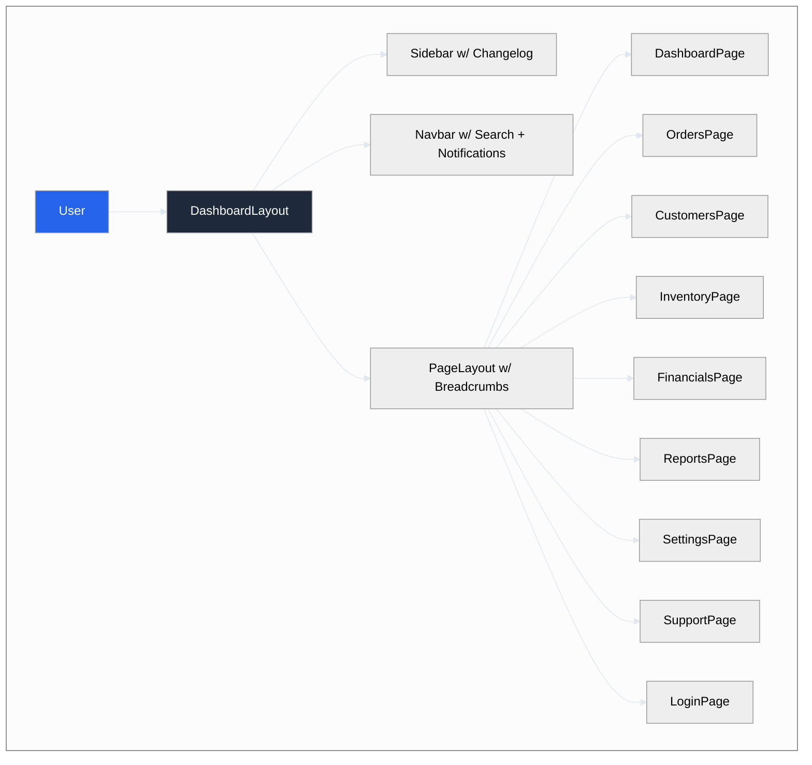
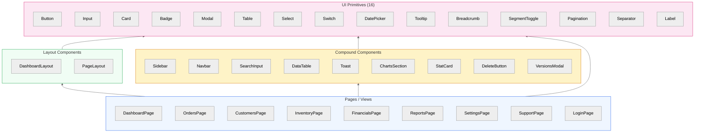
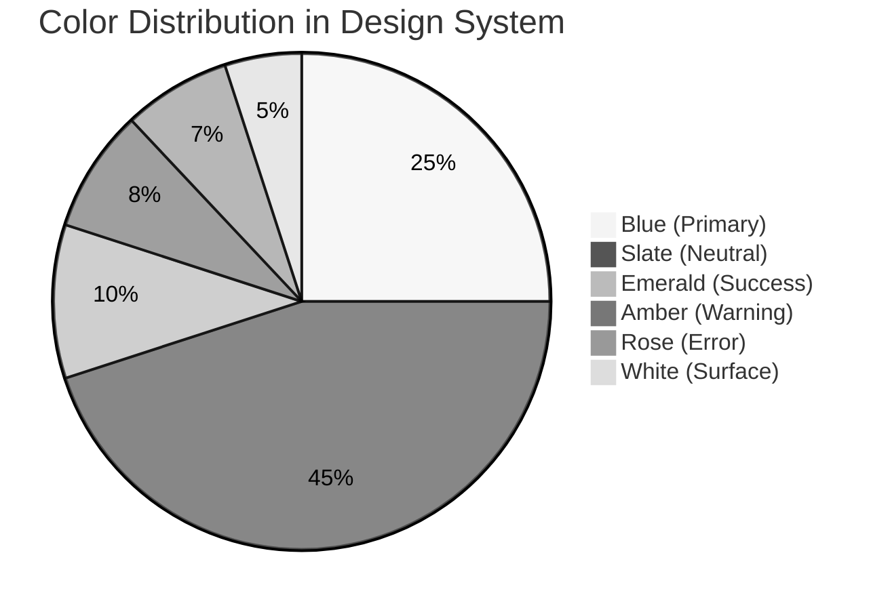
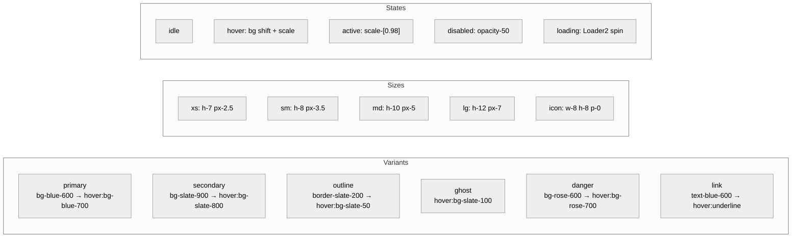
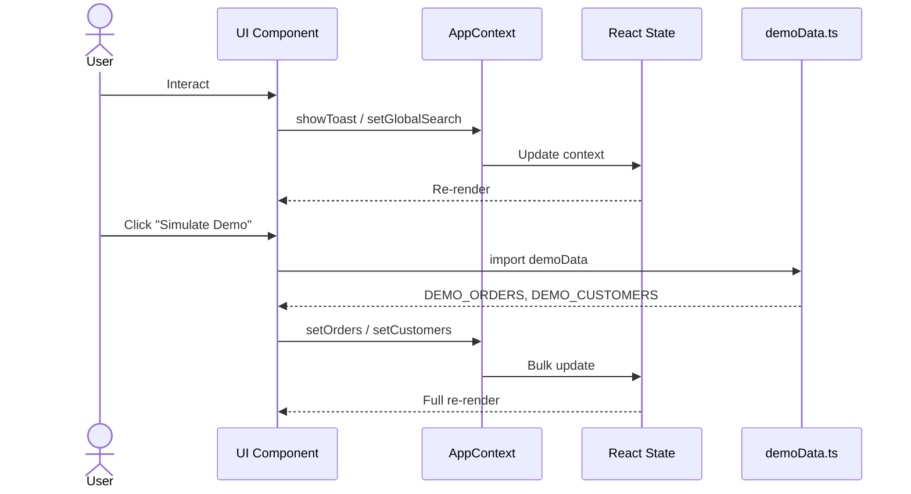
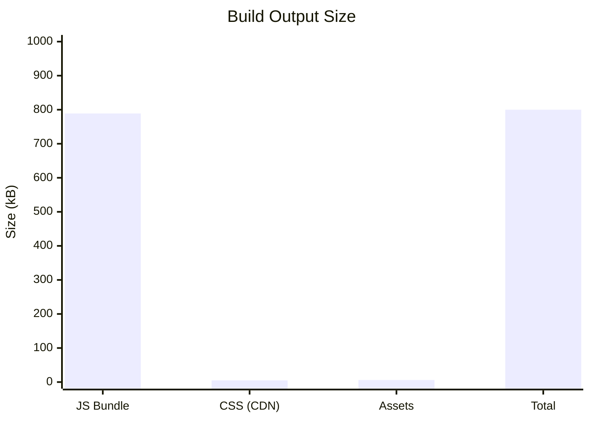

# Aether ERP — Enterprise Design Blueprint

> A high-performance, pixel-perfect ERP dashboard design system — built with React 19, Tailwind CSS 3, and Lucide Icons. Mirrors the production S&M Hub marketing module at 1:1 visual fidelity.



---

## Design System Architecture



---

## Visual Identity

| Token | Value | Usage |
|-------|-------|-------|
| **Primary** | `#2563eb` (Blue 600) | Buttons, switches, active states |
| **Primary Accent** | `#3b82f6` (Blue 500) | Focus rings, highlights |
| **Primary Hover** | `#1d4ed8` (Blue 700) | Button hover |
| **Primary Muted** | `rgba(37,99,235,0.08)` | Soft backgrounds |
| **Surface** | `#ffffff` | Cards, modals |
| **Body BG** | `#f8fafc` (Slate 50) | Page backgrounds |
| **Text Primary** | `#0f172a` (Slate 900) | Headings |
| **Text Body** | `#475569` (Slate 600) | Content |
| **Text Muted** | `#94a3b8` (Slate 400) | Labels |



### Typography Scale

```mermaid
%%{init: {'theme': 'neutral'}}%%
block-beta
    columns 3
        block:Header["Headers"]
            H1["28px — Page Title"]
            H2["22px — Section Header"]
            H3["16px — Card Title"]
            H4["13px — Component Title"]
        end
        block:Body["Body"]
            B1["14px — Table Data"]
            B2["13px — Main Content"]
            B3["12px — Description"]
            B4["11px — Sub-label"]
        end
        block:System["System"]
            S1["10px — Uppercase Label"]
            S2["9px — Badge Text"]
            S3["10px — Meta Data"]
            S4["11px — Breadcrumb"]
        end
    Header --> Body --> System
```



---

## Component Specifications

### Button Variants



### Card Anatomy

```
┌─────────────────────────────────────┐
│  px-6 py-5                           │
│  ┌─────────────────────────────────┐ │
│  │ title (text-base font-semibold)  │ │
│  │ description (text-sm text-500)   │ │ headerAction
│  └─────────────────────────────────┘ │
│  ┌─────────────────────────────────┐ │
│  │ p-6 (content area)              │ │
│  │                                 │ │
│  │                                 │ │
│  └─────────────────────────────────┘ │
│  rounded-2xl border border-slate-200 │
│  shadow-sm bg-white                  │
└─────────────────────────────────────┘
```

---

## Route Map

| Path | Page | Layout |
|------|------|--------|
| `/login` | LoginPage | None (standalone) |
| `/` | DashboardPage | DashboardLayout |
| `/orders` | OrdersPage | DashboardLayout |
| `/customers` | CustomersPage | DashboardLayout |
| `/inventory` | InventoryPage | DashboardLayout |
| `/financials` | FinancialsPage | DashboardLayout |
| `/reports` | ReportsPage | DashboardLayout |
| `/settings` | SettingsPage | DashboardLayout |
| `/support` | SupportPage | DashboardLayout |

---

## Data Flow



---

## Performance



- **JS Bundle**: ~789 kB (gzip: ~224 kB)
- **CDN Tailwind**: loaded externally, zero bundle cost
- **Build time**: ~3.5s
- **Framework**: React 19 + Vite 6

---

## Quickstart

```bash
npm install        # Install dependencies
npm run dev        # Start dev server
npm run build      # Production build → /dist
```

---

## File Structure

```
ERP-design/
├── UI/                        # 16 primitive design components
│   ├── Button.tsx, Card.tsx, Input.tsx, Badge.tsx
│   ├── Modal.tsx, Table.tsx, Select.tsx, Switch.tsx
│   ├── DatePicker.tsx, Tooltip.tsx, Breadcrumb.tsx
│   ├── SegmentToggle.tsx, Pagination.tsx
│   ├── Separator.tsx, Label.tsx, index.ts
├── components/
│   ├── ui/                    # 18 compound components
│   │   ├── Sidebar.tsx, Navbar.tsx, SearchInput.tsx
│   │   ├── DataTable.tsx, Toast.tsx, Modal.tsx
│   │   ├── ChartsSection.tsx, StatCard.tsx
│   │   ├── DeleteButton.tsx, ThemeSwitcher.tsx
│   │   └── TransactionTable.tsx
│   ├── layout/
│   │   ├── DashboardLayout.tsx
│   │   └── PageLayout.tsx
│   └── VersionsModal.tsx
├── pages/
│   ├── DashboardPage.tsx
│   ├── OrdersPage.tsx, CustomersPage.tsx
│   ├── InventoryPage.tsx, FinancialsPage.tsx
│   ├── ReportsPage.tsx, InvoicesPage.tsx
│   ├── SettingsPage.tsx, SupportPage.tsx
│   └── LoginPage.tsx
├── lib/utils.ts               # cn() class merger
├── types.ts                   # Global TypeScript types
├── constants.tsx              # Sidebar link config
├── demoData.ts                # Demo data store
└── App.tsx                    # Router + Context
```

---

## Licensing

Internal design prototype — BeForth Technologies.
