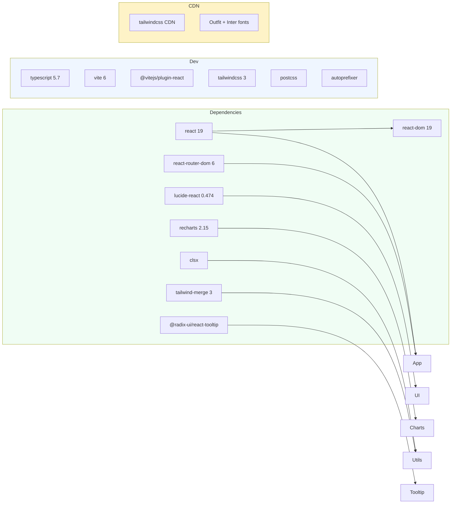

# Aether ERP — Design Specification v1.1.1

> Complete design system reference. Mirrors the production S&M Hub marketing module at 1:1 pixel fidelity. All tokens, components, and patterns documented below.

---

## 1. Design Philosophy

**Subtle Premiumism** — The system prioritizes extreme clarity, hairline depth, and high-end "Pro" aesthetics.

| Principle | Implementation |
|-----------|---------------|
| Zero Bulk | No heavy shadows, no thick borders, no high-contrast saturation |
| Glass & Air | Subtle translucency (`/60`), generous whitespace (`2rem`+) |
| Hairline Borders | All borders `slate-200/60` or lighter (`slate-50`) |
| Micro-Interactivity | Every hover/click has `duration-200` or `duration-300` transition |
| Consistency | Every component uses the same color primitives, spacing scale, radii |

---

## 2. Color System

### 2.1 Brand Palette

```yaml
primary:
  50:  "#eff6ff"
  100: "#dbeafe"
  200: "#bfdbfe"
  500: "#3b82f6"   # accent / focus rings
  600: "#2563eb"   # main primary
  700: "#1d4ed8"   # hover
```

### 2.2 Neutral Palette

```yaml
slate:
  50:  "#f8fafc"   # page background
  100: "#f1f5f9"   # card hover, table header
  200: "#e2e8f0"   # borders / dividers
  300: "#cbd5e1"   # disabled, placeholder
  400: "#94a3b8"   # sub-labels, meta text
  500: "#64748b"   # secondary body
  600: "#475569"   # body text
  700: "#334155"   # emphasis text
  800: "#1e293b"   # near-black
  900: "#0f172a"   # headings
```

### 2.3 Semantic Colors

| Role | Text | Background | Border | Icon |
|------|------|------------|--------|------|
| Success | `emerald-600` | `emerald-50` | `emerald-200` | `emerald-500` |
| Warning | `amber-600` | `amber-50` | `amber-200` | `amber-500` |
| Error | `rose-600` | `rose-50` | `rose-200` | `rose-600` |
| Info | `blue-600` | `blue-50` | `blue-200` | `blue-500` |

### 2.4 Toast Color Mapping

| Type | BG | Border | Icon |
|------|----|--------|------|
| `success` | `bg-emerald-50` | `border-emerald-100` | `CheckCircle` (emerald-500) |
| `error` | `bg-rose-50` | `border-rose-100` | `AlertCircle` (rose-500) |
| `info` | `bg-blue-50` | `border-blue-100` | `Info` (blue-500) |

### 2.5 Badge Variants

| Variant | Classes |
|---------|---------|
| default | `bg-slate-100 text-slate-700 border-slate-200` |
| success | `bg-emerald-50 text-emerald-700 border-emerald-200` |
| warning | `bg-amber-50 text-amber-700 border-amber-200` |
| error | `bg-rose-50 text-rose-700 border-rose-200` |
| outline | `bg-transparent text-slate-500 border-slate-200` |

---

## 3. Typography

### 3.1 Font Stack

```css
font-family: 'Outfit', 'Inter', system-ui, -apple-system, sans-serif;
```

Weights used: **300** (light), **400** (normal), **500** (medium), **600** (semibold), **700** (bold), **800** (extrabold), **900** (black)

### 3.2 Type Scale

| Context | Size | Weight | Tracking | Color |
|---------|------|--------|----------|-------|
| Page Title | `text-2xl` (24px) | `font-bold` | `tracking-tight` | `slate-900` |
| Section Header | `text-lg` (18px) | `font-semibold` | — | `slate-900` |
| Card Title | `text-base` (16px) | `font-semibold` | — | `slate-900` |
| Component Title | `text-[13px]` | `font-bold` | `tracking-tight` | `slate-900` |
| Body Text | `text-sm` (14px) | `font-medium` | — | `slate-600` |
| Description | `text-xs` (12px) | `font-medium` | — | `slate-500` |
| Sub-label | `text-[11px]` | `font-semibold` | — | `slate-400` |
| Meta Label | `text-[10px]` | `font-bold` | `uppercase tracking-widest` | `slate-400` |
| Badge Text | `text-[9px]` | `font-black` | `uppercase tracking-wider` | variant-dep. |
| Breadcrumb | `text-[11px]` | `font-semibold` | — | `slate-400` |

### 3.3 Tabular Data

All monetary values, counts, and dates in DataTable must use Tailwind's `tabular-nums` for vertical alignment.

---

## 4. Spacing & Layout

### 4.1 Spacing Scale

| Token | Value | Context |
|-------|-------|---------|
| `gap-8` | 2rem | Major grid gaps |
| `p-6` | 1.5rem | Card content |
| `px-6 py-5` | 1.5rem / 1.25rem | Card header |
| `px-4 py-3` | 1rem / 0.75rem | Table cells |
| `px-3 py-2.5` | 0.75rem / 0.625rem | Sidebar items |
| `gap-3` | 0.75rem | Button icon spacing |
| `gap-1.5` | 0.375rem | Tight element groups |

### 4.2 Border Radius

| Context | Radius | Class |
|---------|--------|-------|
| Cards / Modals | 16px | `rounded-2xl` |
| Buttons / Inputs | 12px | `rounded-xl` |
| Badges / Small icons | 8px | `rounded-lg` |
| Pills / Tags | 9999px | `rounded-full` |

### 4.3 Shadows

```yaml
card: "0 1px 3px rgba(0,0,0,0.05), 0 10px 40px -15px rgba(0,0,0,0.02)"
card-hover: "0 4px 20px rgba(37,99,235,0.08), 0 1px 3px rgba(0,0,0,0.05)"
modal: "0 25px 50px -12px rgba(0,0,0,0.25)"
button-primary: "0 1px 3px rgba(37,99,235,0.3)"
dropdown: "0 10px 40px -5px rgba(0,0,0,0.08), 0 0 0 1px rgba(0,0,0,0.02)"
```

### 4.4 Layout Dimensions

| Element | Width | Height |
|---------|-------|--------|
| Sidebar | 240px (`w-60`) | 100vh |
| Navbar | — | 64px (`h-16`) |
| Page Content | `calc(100vw - 240px)` | — |
| Page Header | — | auto (title + description) |
| Card Min Width | 280px | — |

---

## 5. Component Specifications

### 5.1 Button (`UI/Button.tsx`)

```yaml
base:
  classes: "inline-flex items-center justify-center transition-all duration-200 disabled:opacity-50 disabled:pointer-events-none whitespace-nowrap font-semibold"
  active: "active:scale-[0.98]"

variants:
  primary:   "bg-blue-600 text-white shadow-sm hover:bg-blue-700 hover:shadow-blue-500/20"
  secondary: "bg-slate-900 text-white hover:bg-slate-800 shadow-sm"
  outline:   "bg-white text-slate-700 border border-slate-200 hover:bg-slate-50 hover:border-slate-300 shadow-xs"
  ghost:     "text-slate-500 hover:bg-slate-100 hover:text-slate-900"
  danger:    "bg-rose-600 text-white hover:bg-rose-700 shadow-sm"
  link:      "text-blue-600 hover:underline font-semibold p-0 h-auto"

sizes:
  xs:  "h-7 px-2.5 text-[10px] rounded-lg"
  sm:  "h-8 px-3.5 text-xs rounded-xl"
  md:  "h-10 px-5 text-sm rounded-xl"
  lg:  "h-12 px-7 text-base rounded-xl"
  icon: "w-8 h-8 p-0 rounded-lg"
```

### 5.2 Card (`UI/Card.tsx`)

```yaml
base: "rounded-2xl border border-slate-200 bg-white text-slate-950 shadow-sm transition-all duration-300"
hoverable: "hover:shadow-md hover:border-blue-200/50 hover:-translate-y-1"
parts:
  header: "flex flex-col space-y-1.5 p-6"
  title: "text-base font-semibold text-slate-900"
  description: "text-sm font-semibold text-slate-500"
  content: "p-6 pt-0"
  footer: "flex items-center p-6 pt-0"
```

### 5.3 Input (`UI/Input.tsx`)

```yaml
base: "w-full border rounded-lg text-left transition-all focus:outline-none focus:ring-2 focus:ring-blue-500/20 focus:border-blue-500 bg-white border-slate-300 shadow-sm placeholder:text-slate-400"
sizes:
  sm: "h-9 px-3 text-xs"
  md: "h-10 px-4 text-sm font-medium"
  lg: "h-12 px-5 text-base"
states:
  disabled: "bg-slate-50 cursor-not-allowed opacity-50"
  error: "border-rose-300 bg-rose-50 placeholder:text-rose-400"
variants:
  default: "bg-white border-slate-300"
  white: "bg-white border-slate-200"
```

### 5.4 DataTable (`components/ui/DataTable.tsx`)

```yaml
container:
  bordered: "border border-slate-200 rounded-2xl bg-white shadow-xs"
header:
  row: "bg-slate-50 border-b border-slate-200"
  cell: "h-10 px-4 text-left text-[10px] font-bold uppercase tracking-wider text-slate-500 select-none"
  sortable: "hover:bg-slate-100/70 transition-colors duration-150 group"
  sort_icon: "size-[10px] ml-1 inline-block"
body:
  row: "border-b border-slate-200/60 transition-colors duration-100"
  row_hover: "hover:bg-slate-50/40"
  row_clickable: "cursor-pointer hover:bg-slate-50/60 active:bg-slate-50/90"
  cell: "px-4 py-3 align-middle text-xs font-normal text-slate-800 truncate"
  cell_dense: "py-2"
  cell_first: "pl-6"
loading:
  skeleton: "h-3 rounded bg-slate-100 animate-pulse"
empty:
  icon: "w-9 h-9 rounded-lg bg-slate-50 border border-slate-200/50 flex items-center justify-center"
  text: "text-[10px] font-bold uppercase tracking-wider text-slate-400"
```

### 5.5 Modal (`components/ui/Modal.tsx`)

```yaml
backdrop: "fixed inset-0 bg-slate-900/55 z-[120]"
position: "fixed inset-0 z-[120] flex items-center justify-center p-4 isolate"
animation: "animate-in fade-in zoom-in-95 duration-150"
content:
  base: "relative w-full bg-white rounded-2xl shadow-2xl border border-slate-200 overflow-visible"
  default_width: "max-w-lg"
header: "px-6 py-4 border-b border-slate-100 flex items-center justify-between rounded-t-2xl bg-white"
body: "p-6 max-h-[70vh] overflow-y-auto"
footer: "px-6 py-4 bg-slate-50 border-t border-slate-100 flex justify-end gap-3"
portal: "rendered at document.body via createPortal"
```

### 5.6 Sidebar (`components/ui/Sidebar.tsx`)

```yaml
dimensions: "w-60 h-screen bg-white border-r border-slate-200/60 fixed left-0 top-0 z-30"
logo: "flex items-center gap-2.5 mb-7 px-2"
branding: "Powered by BeForth (text-[11px])"
version: "v1.1.1 — click to open changelog"
nav:
  section_label: "px-3 text-[10px] font-bold text-slate-400 uppercase tracking-widest mb-2"
  item:
    base: "group flex items-center justify-between w-full rounded-lg text-[13px] transition-all duration-200 font-medium px-3 py-2"
    idle: "text-slate-600 hover:bg-slate-50 hover:text-slate-900"
    active: "bg-blue-50 text-blue-700"
    icon: "size-[18px] stroke-[1.8] group-hover:text-slate-600"
    icon_active: "text-blue-600 stroke-[2.2]
user_card: "mt-4 p-2.5 rounded-xl border border-slate-100/80 bg-slate-50/50"
```

### 5.7 Navbar (`components/ui/Navbar.tsx`)

```yaml
dimensions: "h-16 bg-white border-b border-slate-200/60 sticky top-0 z-20"
search: "max-w-md"
notifications:
  badge: "absolute -top-1 -right-1 w-4 h-4 bg-rose-500 text-white text-[9px] font-bold rounded-full flex items-center justify-center shadow-sm"
  dropdown: "absolute right-0 top-full mt-2 w-96 bg-white rounded-2xl border border-slate-200 shadow-2xl"
  item: "px-5 py-4 hover:bg-slate-50 transition-colors cursor-pointer border-b border-slate-100 last:border-0"
user:
  avatar: "w-8 h-8 rounded-lg bg-blue-100 flex items-center justify-center border border-blue-200/50"
  name: "text-[12px] font-semibold text-slate-900 truncate"
  role: "text-[10px] text-slate-500 font-medium truncate"
```

### 5.8 SearchInput (`components/ui/SearchInput.tsx`)

```yaml
container: "relative group/search flex items-center w-full"
input:
  base: "w-full bg-white border border-slate-200 rounded-full outline-none transition-all shadow-sm"
  hover: "hover:border-slate-300 hover:bg-slate-50/50"
  focus: "focus:ring-4 focus:ring-blue-500/10 focus:border-blue-500 focus:shadow-md"
  placeholder: "placeholder:text-slate-400"
  md: "h-10 pl-11 pr-10 text-[13px] font-medium"
  sm: "h-9 pl-9 pr-9 text-xs"
icon: "absolute left-4 top-1/2 -translate-y-1/2 text-slate-400 group-focus-within/search:text-blue-600"
clear: "absolute right-3 p-1.5 hover:bg-slate-100 rounded-full text-slate-400 hover:text-slate-600"
```

### 5.9 Toast (`components/ui/Toast.tsx`)

```yaml
position: "fixed bottom-8 right-8 z-[100]"
base: "flex items-center gap-3 px-4 py-3 rounded-xl border shadow-lg animate-in slide-in-from-right-10 fade-in duration-300"
variants:
  success: "bg-emerald-50 border-emerald-100"
  error: "bg-rose-50 border-rose-100"
  info: "bg-blue-50 border-blue-100"
icon: "size-[18px]"
close: "ml-2 p-1 hover:bg-black/5 rounded-lg transition-colors"
text: "text-sm font-semibold text-slate-800"
autodismiss: "3000ms (default) — configurable"
```

### 5.10 Select (`components/ui/Select.tsx`)

```yaml
trigger: "w-full border rounded-lg text-left transition-all focus:outline-none focus:ring-2 focus:ring-blue-500 shadow-sm bg-white border-slate-300 hover:border-slate-400 hover:bg-slate-50/30 font-medium"
sizes:
  sm: "h-9 px-3 text-xs"
  md: "h-10 px-4 text-sm font-medium"
dropdown:
  portal: true (rendered at document.body)
  z-index: "z-[99999]"
  classes: "fixed bg-white border border-slate-200 rounded-xl shadow-2xl animate-in fade-in zoom-in-95 duration-150"
  max-height: "300px"
search:
  input: "w-full pl-8 pr-3 py-1.5 text-xs border border-slate-200 rounded-lg focus:outline-none focus:ring-2 focus:ring-blue-500 bg-white"
option:
  idle: "hover:bg-slate-50 text-slate-600"
  selected: "bg-blue-50 text-blue-700 font-bold"
  active: "bg-slate-100"
```

---

## 6. Animation Spec

```yaml
durations:
  hover: "duration-200"
  page: "duration-300"
  modal: "duration-150"
  toast: "duration-300"

easing:
  default: "ease-in-out"
  modal: "cubic-bezier(0.4, 0, 0.2, 1)"

animations:
  modal_enter: "animate-in fade-in zoom-in-95"
  toast_enter: "animate-in slide-in-from-right-10 fade-in"
  skeleton: "animate-pulse"
  spinner: "animate-spin"
  tab_indicator: "animate-in fade-in duration-200"

transitions:
  button: "all duration-200 active:scale-[0.98]"
  card: "all duration-300 hover:-translate-y-1"
  sidebar_item: "all duration-200"
  nav_link: "all duration-200"
  accordion: "all duration-300 ease-in-out (max-height + opacity)"
```

---

## 7. Iconography

| Context | Size | Stroke Width | Library |
|---------|------|-------------|---------|
| Sidebar nav | 18px | 1.8 (idle) / 2.2 (active) | Lucide |
| Page actions | 16px | 2.5 | Lucide |
| Inline / Buttons | 14px | 2.5 | Lucide |
| Small badges | 12px | 2.5 | Lucide |
| Tiny meta | 10-11px | 3 | Lucide |
| Toast / Status | 18px | 2 | Lucide |
| Search magnifier | 16px | 2.5 | Lucide |

---

## 8. Responsive Breakpoints

| Breakpoint | Width | Behavior |
|------------|-------|----------|
| Mobile | `< 768px` | Single column, sidebar hidden |
| Tablet | `768px - 1024px` | 2-column grids, compact nav |
| Desktop | `1024px - 1280px` | 3-column grids |
| Wide | `> 1280px` | 4-column grids, full layout |

---

## 9. Interaction Patterns

### Button Click
```
hover → bg-darkens + cursor-pointer
active → scale-[0.98] (100ms)
release → scale-100 + action fires
disabled → opacity-50 + no-pointer
loading → icon replaced by Loader2 spin
```

### Sidebar Nav
```
hover → bg-slate-50 + text darkens
active → bg-blue-50 + text-blue-600 + icon-blue-600
transition → all 200ms
```

### DataTable Sort
```
click header → ArrowUpDown → ArrowUp (asc) → ArrowDown (desc)
icon text → slate-300 → blue-600
```

### Toast Lifecycle
```
trigger → animate-in slide-in-from-right (300ms)
display → 3000ms (default)
autodismiss → animate-out (not implemented w/o framer-motion)
manual close → X button on hover
```

---

## 10. Accessibility Notes

- All interactive elements have `focus:outline-none focus:ring-2 focus:ring-blue-500/20`
- Color is never the sole indicator of state (icons + text + bg patterns used)
- Font sizes are relative (`text-sm`, `text-xs`) for browser zoom support
- Buttons maintain minimum `h-7` touch target
- Select has full ARIA: `role="listbox"`, `aria-expanded`, `aria-activedescendant`
- Tooltip uses Radix UI primitives for proper focus management and ARIA

---

## 11. File Reference

| File Path | Export | Role |
|-----------|--------|------|
| `UI/Button.tsx` | `Button` | 6-variant button with loading state |
| `UI/Card.tsx` | `Card, CardHeader, CardTitle, CardDescription, CardContent, CardFooter` | Composite card system |
| `UI/Input.tsx` | `Input` | Styled input with icon/prefix/rightElement/size/variant/error |
| `UI/Badge.tsx` | `Badge` | 5-variant inline badge |
| `UI/Modal.tsx` | `Modal` | Compound modal with portal + animation |
| `UI/Table.tsx` | `Table, TableHeader, TableBody, TableRow, TableHead, TableCell` | Semantic table components |
| `UI/Select.tsx` | `Select` | Custom dropdown with portal, search, combobox, creatable |
| `UI/Switch.tsx` | `Switch` | Toggle switch |
| `UI/DatePicker.tsx` | `DatePicker` | Date input picker |
| `UI/Tooltip.tsx` | `Tooltip, TooltipProvider` | Radix-based tooltip with portal + arrow |
| `UI/Breadcrumb.tsx` | `Breadcrumb, BreadcrumbItem` | Navigation breadcrumbs |
| `UI/SegmentToggle.tsx` | `SegmentToggle` | Segmented control (CSS-animated indicator) |
| `UI/Pagination.tsx` | `Pagination` | Page navigation |
| `UI/Separator.tsx` | `Separator` | Horizontal/vertical divider |
| `UI/Label.tsx` | `Label` | Form label |
| `components/ui/Sidebar.tsx` | `Sidebar` | Fixed sidebar with nav + changelog |
| `components/ui/Navbar.tsx` | `Navbar` | Top nav with search + notifications |
| `components/ui/DataTable.tsx` | `DataTable, Column` | Sortable/filterable data table |
| `components/ui/SearchInput.tsx` | `SearchInput` | Rounded search with clear |
| `components/ui/Toast.tsx` | `Toast, ToastType` | Auto-dismiss toasts |
| `components/ui/Modal.tsx` | `Modal` | Compound modal component |
| `components/ui/ChartsSection.tsx` | `ChartsSection, CustomTooltip` | Chart containers with Recharts |
| `components/ui/StatCard.tsx` | `StatCard` | KPI metric card |
| `components/ui/DeleteButton.tsx` | `DeleteButton` | Destructive action button |
| `components/ui/Select.tsx` | `Select` | Advanced dropdown component |
| `components/ui/Pagination.tsx` | `Pagination` | Rich pagination with page size |
| `components/VersionsModal.tsx` | `VersionsModal` | Changelog modal (static mock) |
| `components/layout/DashboardLayout.tsx` | `DashboardLayout` | App shell (sidebar + navbar + content) |
| `components/layout/PageLayout.tsx` | `PageLayout` | Page wrapper (title + breadcrumbs + actions) |
| `lib/utils.ts` | `cn` | Tailwind class merger (clsx + twMerge) |
| `types.ts` | `NavItem, AppNotification, etc.` | TypeScript interfaces |
| `constants.tsx` | `SIDEBAR_LINKS, SECONDARY_LINKS` | Navigation config |
| `demoData.ts` | `DEMO_ORDERS, DEMO_CUSTOMERS, etc.` | Demo data |

---

## 12. Dependency Map



---

> *Last updated: June 28, 2026 — Version 1.1.1*
